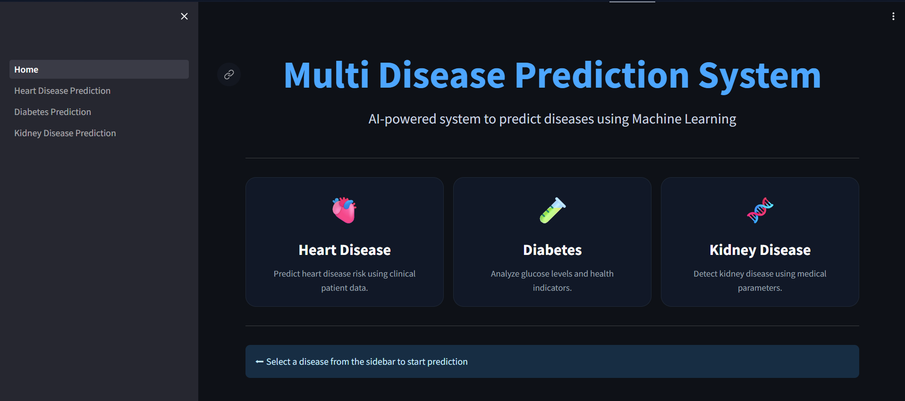

# Multi-Disease Prediction System

A Machine Learning powered healthcare web application that predicts the risk of multiple diseases based on patient clinical data.

This project demonstrates how Artificial Intelligence and Machine Learning can assist in early disease detection using medical indicators and predictive models.

The application is built using Python, Scikit-Learn, and Streamlit, and deployed as an interactive web app.

---

## Live Demo

Hugging Face Deployment  
[https://huggingface.co/spaces/codedevrosch/multi_disease_prediction](https://huggingface.co/spaces/codedevrosh/multi_disease_prediction)

## Application Preview



---

## Diseases Supported

This application predicts the risk of multiple diseases using machine learning models.  
All prediction models in this system are implemented using the **Random Forest Classifier**, a robust ensemble learning algorithm known for its high accuracy and ability to handle complex datasets.

### Heart Disease Prediction
This module predicts the likelihood of heart disease using patient clinical data and medical indicators.

### Diabetes Prediction
This module predicts the probability of diabetes based on patient health information and diagnostic measurements.

### Kidney Disease Prediction
This module estimates the risk level of kidney disease using clinical and biochemical indicators related to kidney function.


## Machine Learning Pipeline

The following steps were used to build the models:

1. Data Cleaning  
2. Missing Value Handling  
3. Encoding Categorical Variables  
4. Outlier Handling using IQR Method  
5. Feature Selection using Recursive Feature Elimination (RFE)  
6. Feature Scaling  
7. Handling Class Imbalance using SMOTE  
8. Model Training  
9. Model Evaluation  
10. Model Deployment with Streamlit

---

## Technologies Used

- Python  
- Scikit-Learn  
- Pandas  
- NumPy  
- Streamlit  
- Joblib  
- Hugging Face Spaces

---

## Project Structure

```
multi_disease_prediction
│
├── Home.py  
├── requirements.txt
├── README.md
│
├── models                 
│ ├── heart_disease_model.pkl
│ ├── diabetes_model.pkl
│ └── kidney_model.pkl
│
├── pages
│ ├── 1_Heart_Disease_Prediction.py
│ ├── 2_Diabetes_Prediction.py
│ └── 3_Kidney_Disease_Prediction.py
│
├── notebooks
│ ├── heart_disease.ipynb
│ ├── diabetes.ipynb
│ └── kidney_disease.ipynb
│
└── data
  ├── heart.csv
  ├── diabetes.csv
  └── kidney_disease.csv
```

---
## Conclusion

This project demonstrates how machine learning can be used to support early detection of common health conditions. By integrating multiple prediction models into a single Streamlit application, the system provides an easy-to-use interface for estimating the risk of heart disease, diabetes, and kidney disease.

---

##  Author

Arockia Roshan A  
Machine Learning & Data Science Enthusiast
